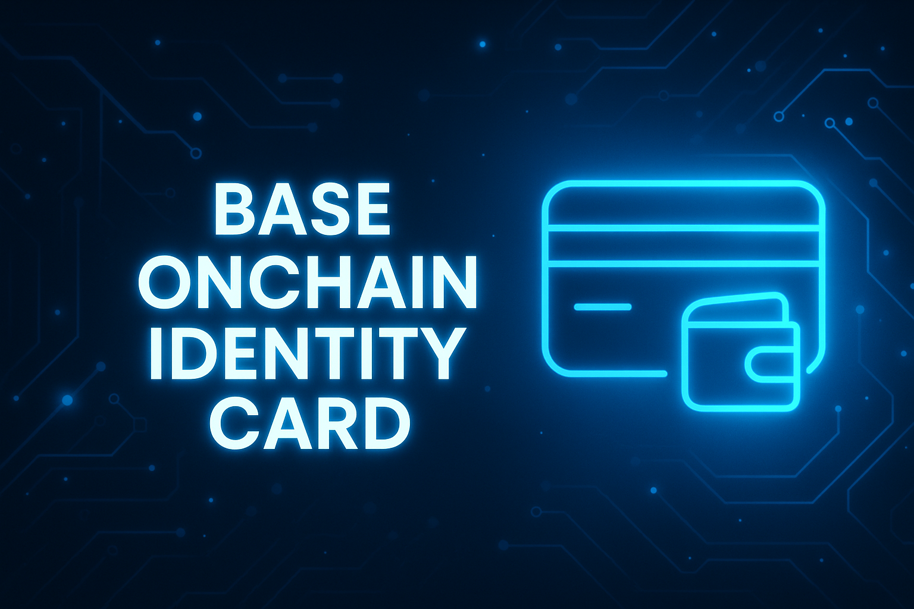

# Base Onchain Identity Card
A modern onchain analytics tool that generates **beautiful, downloadable identity cards** for any wallet on **Base**.  
Built by **ZiZ 🧿** using React, TailwindCSS, and the BaseScan API.

<p align="center">
  
</p>

A focused web app for generating a clean onchain identity card from any Base wallet address.  
Enter an address → fetch onchain activity → generate a compact identity card → export it as a PNG.  
The app even supports **zero-activity wallets**, generating a minimal card instead of errors.

---

## 🚀 Features

- **Wallet Identity Overview**  
  Shortened address, ENS/Base name (if available), avatar, BaseScan link

- **Activity Stats**  
  Transaction count, first seen date, total in/out ETH, gas used, active days

- **Builder Score (0–100)** with tier-based Rank badge

- **Token Summary**  
  Token count derived from transfer logs

- **NFT Summary**  
  Lightweight NFT count preview

- **Badges**  
  Power User / High Volume / Token Explorer / NFT Enjoyooor / Consistent / Active

- **PNG Export**  
  High-quality export using `html-to-image`

- **Responsive UI**  
  Optimized for both desktop and mobile

---

## ⚙️ Installation

### 1️⃣ Clone the repository
```sh
git clone https://github.com/RealZiZ/Base-onchain-identity.git
cd Base-onchain-identity
```
### 2️⃣ Install dependencies
```sh
npm install
```
### 3️⃣ Create a .env file
```sh
VITE_ETHERSCAN_API_KEY=your_api_key_here
```
### 4️⃣ Start the development server
```sh
npm run dev
```
5️⃣ Open the app
```sh
http://localhost:5173
```
Paste any Base wallet address → generate its identity card.


## 🔒 Usage Notes & Privacy

-PNG export happens fully locally in the browser.

-The app sends no data to any backend.

-Only BaseScan API calls are made to fetch public onchain data.

-Zero-activity wallets still generate a clean minimal card.

## ⚠️ Current Limitations

-PNG export may exclude token/NFT images if external hosts block CORS.

-Token/NFT counts are based on transfer logs, not exact contract calls.

-High-rate API requests may produce temporary “NOTOK” responses.

-Badges and Builder Score are designed for visualization, not exact ranking.

## 🛠️ Development

-Framework: React + Vite

-Styling: TailwindCSS

-Core logic: src/api/baseIdentityApi.js

-UI components: src/components/IdentityCard.jsx

-Export engine: src/utils/exportCard.js

## 👤 Credits

-Built with ❤️ by ZiZ (RealZiZ)
-Follow on Base & X(Twitter) for updates, new tools, and open-source drops.
