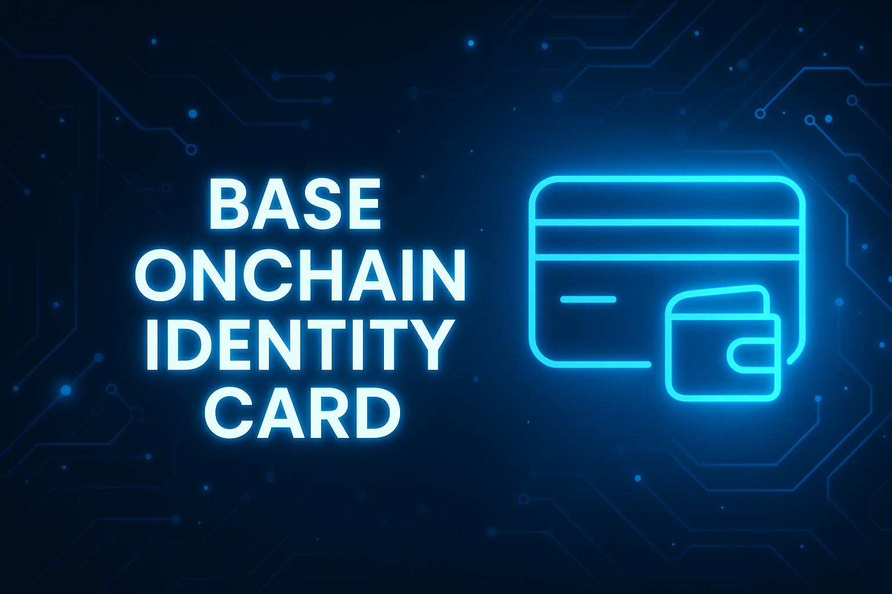

# Base Onchain Identity Card  
A modern onchain analytics tool that generates **beautiful, shareable identity cards** for any wallet on **Base**.  
Built by **ZiZ** 🧿 using React, TailwindCSS, and the BaseScan API.

<p align="center">
  
# Base Onchain Identity Card

A small, focused web tool that generates a clean onchain identity card for any wallet address on the Base chain.

This app fetches onchain data (transactions, token transfers, NFT transfers) and presents a compact, shareable-looking identity card you can export as a PNG.

**Key points:**
- Enter a Base address to generate a profile card.
- The card shows activity stats, a simple "Builder Score", badges, token/NFT summaries, and an avatar/address header.
- You can export the card as a clean PNG using the Download button (no built-in social posting in the UI).
- The app will render a card even for addresses with zero transactions — a minimal "no activity" card is shown.

---

**Features**

- Identity & activity stats: shortened address, tx count, first seen, totals in/out, gas used, active days.
- Builder Score (0–100) and a simple Rank badge.
- Token and NFT summaries derived from transfer data.
- Badges generated from activity heuristics.
- Clean PNG export via `html-to-image`.
- Responsive React + Tailwind UI.

---

**Quick Start**

1. Clone the repository:

```powershell
git clone https://github.com/0xZiZ/Base-onchain-identity.git
cd Base-onchain-identity
```

2. Install dependencies:

```powershell
npm install
```

3. Add a `.env` file in the project root with your BaseScan / Etherscan-compatible API key (see provider docs):

```text
VITE_ETHERSCAN_API_KEY=your_api_key_here
```

4. Run the dev server:

```powershell
npm run dev
```

5. Open the app in your browser (usually at `http://localhost:5173`) and paste a Base address to generate the card.

---

**Usage notes & privacy**

- The app uploads nothing by default — the PNG export is generated client-side. The app does make API calls to BaseScan (via your API key) to fetch onchain data.
- If you remove the API key, some features (transactions, tokens, NFTs) will be unavailable.

---

**Current limitations**

- The exported PNG is generated from the DOM and may not include externally-hosted token/NFT images that require CORS unless those images allow cross-origin access.
- Token balances are approximated from transfer lists and may be incomplete. For precise balances, additional provider calls are required.

---

**Development**

- Built with React + Vite + TailwindCSS.
- Main source files are in `src/`.
- Identity API logic is in `src/api/baseIdentityApi.js`.

---

If you want, I can also remove the old share helper file (`src/utils/shareCard.js`) and update README references to sharing — just tell me to proceed.

---

Credits: Built by ZiZ.


### 1️⃣ Clone the repo

```sh

git clone https://github.com/0xZiZ/Base-onchain-identity

